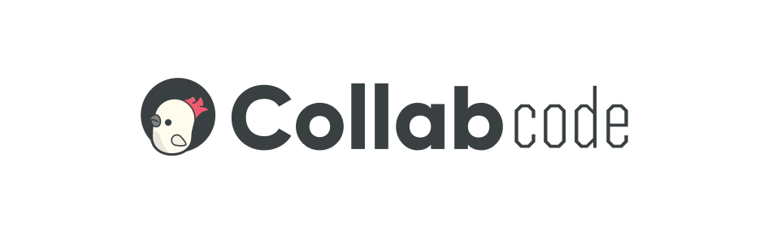

# CollabCode Weekly

[Envie sua ideia agora e apareça no twitter e weekly da CollabCode](https://github.com/CollabCodeTech/weekly/issues).

Toda segunda-feira enviamos um email para a comunidade da CollabCode, nesse email tem uma história para eu me divertir escrevendo e espero que você se divirta lendo, em seguida as novidades da semana que acontecerá na CollabCode e por último o conteúdo da comunidade, como:

- Post;
- Vídeos;
- Canais de lives;
- Eventos;
- Meetups;
- Mundo opensource;
- E outras coisas mais.

> **Mantenedores:** [Jovis Jardim](https://twitter.com/jovianejardim) e [Marco Bruno](https://twitter.com/marcobrunobr)

## Envie sua ideia

Quer ver um conteúdo de um amigo ou até o seu conteúdo sendo divulgado pelo [twitter da CollabCode](https://twitter.com/collabcodetech) fique a vontade e envie para gente.

[Envie sua ideia agora](https://github.com/CollabCodeTech/weekly/issues).

## Participe da comunidade da CollabCode

Nosso canal principal de divulgação e tudo mais é o Discord, entre em nosso servidor do Discord e troque conhecimento de forma feliz e segura.

[Entre agora no Discord da CollabCode](https://discord.gg/YeeEAYj)

### Nossa grande referência

Esse sistema de conseguir fazer a comunidade contribuir com nossa weekly foi totalmente referênciada no sistema que não sei se foi criado pela BrazilJS mas foir por onde conheci. Recomendo você também indicar o seu conteúdo na weekly deles, principamente se o tema for JS 😄

[BrazilJS Weekly](https://github.com/braziljs/weekly)